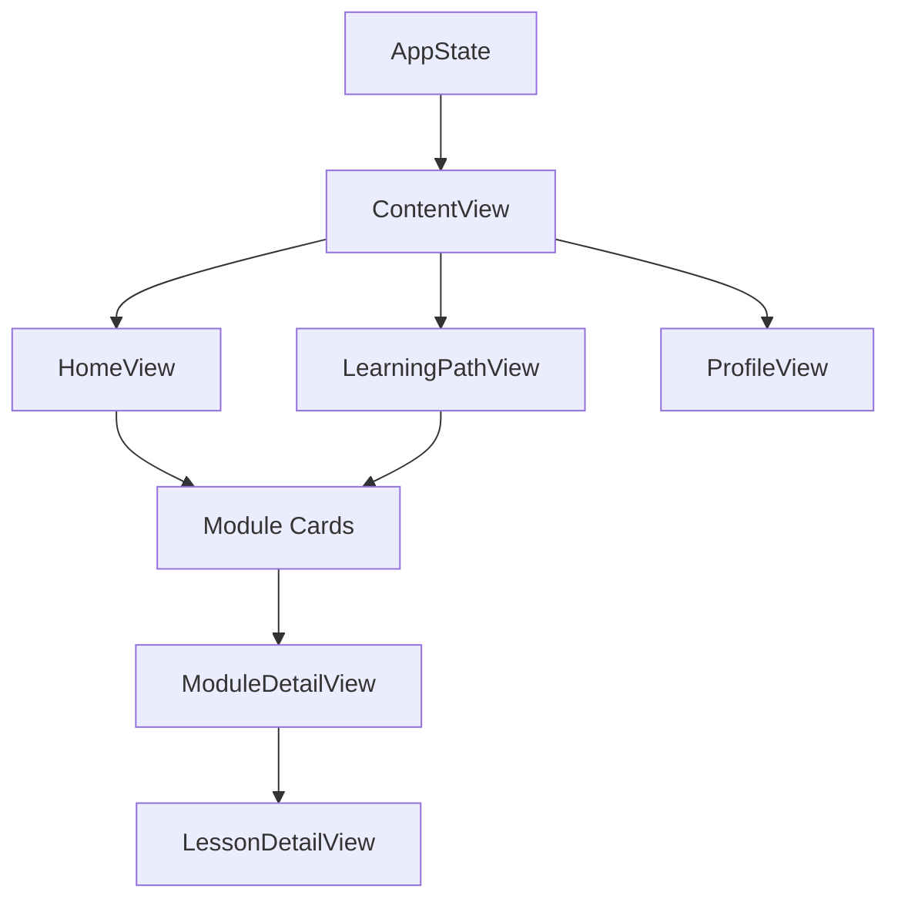

# 📱 EnergyAI Academy iOS App - Complete Development Guide

> A comprehensive guide to developing, maintaining, and monetizing the EnergyAI Academy iOS app using SwiftUI and Claude Code.

## Table of Contents

1. [Xcode Project Setup](#1-xcode-project-setup)
2. [Development with Claude Code](#2-development-with-claude-code)
3. [File Management in Xcode](#3-file-management-in-xcode)
4. [Project Architecture Guide](#4-project-architecture-guide)
5. [Adding New Course Content](#5-adding-new-course-content)
6. [Modifying App Functionality](#6-modifying-app-functionality)
7. [App Store Deployment & Monetization](#7-app-store-deployment--monetization)
8. [Troubleshooting & Best Practices](#8-troubleshooting--best-practices)

---

## 1. Xcode Project Setup

### Prerequisites
- **macOS** (Monterey 12.0 or later recommended)
- **Xcode 14.0+** (download from Mac App Store)
- **Apple Developer Account** (for device testing and App Store distribution)

### Step-by-Step Project Creation

#### 1.1 Create New Xcode Project
```bash
1. Open Xcode
2. Click "Create a new Xcode project"
3. Select "iOS" → "App"
4. Configure project:
   - Product Name: EnergyAIAcademy
   - Interface: SwiftUI
   - Language: Swift
   - Bundle Identifier: com.yourcompany.energyaiacademy
   - Use Core Data: ❌
   - Include Tests: ✅
```

#### 1.2 Project Settings Configuration
```bash
# In Xcode project settings:
1. Select project name (blue icon) in navigator
2. Under "Deployment Info":
   - Minimum Deployments: iOS 15.0
   - Supported Devices: iPhone & iPad
   - Supported Orientations: Portrait, Landscape

3. Under "Signing & Capabilities":
   - Automatically manage signing: ✅
   - Team: Your Apple Developer Team
   - Bundle Identifier: com.yourcompany.energyaiacademy
```

#### 1.3 Initial Project Structure
```
EnergyAIAcademy/
├── EnergyAIAcademy/
│   ├── ContentView.swift
│   ├── EnergyAIAcademyApp.swift
│   └── Assets.xcassets/
├── EnergyAIAcademyTests/
└── EnergyAIAcademyUITests/
```

---

## 2. Development with Claude Code

### 2.1 Setting Up Claude Code Workflow

#### Installing Claude Code
```bash
# Install Claude Code CLI (if not already installed)
curl -fsSL https://claude.ai/install.sh | sh

# Or download from: https://claude.ai/code
```

#### Recommended Development Setup
```bash
# 1. Open terminal in your project directory
cd /path/to/your/project/EnergyAIAcademy

# 2. Start Claude Code session
claude-code

# 3. Open Xcode alongside Claude Code for real-time development
```

### 2.2 Coding with Claude Code

#### Effective Prompting for iOS Development
```markdown
# Good prompts for iOS development:
"Create a SwiftUI view for displaying course modules with cards"
"Add navigation functionality to the module cards"
"Implement a liquid glass design system with blur effects"
"Fix build errors in the iOS project"
"Update the color scheme to match the web app design"
```

#### File Creation Workflow
```bash
# Claude Code will create files like:
1. Ask Claude to create/modify Swift files
2. Claude generates code and saves to project directory
3. You add these files to Xcode project (see section 3)
4. Build and test in Xcode
5. Iterate with Claude for refinements
```

### 2.3 Best Practices with Claude Code

#### DO's:
- ✅ Ask Claude to read existing files before making changes
- ✅ Request step-by-step instructions for complex tasks
- ✅ Use Claude to fix build errors by sharing error messages
- ✅ Ask for explanations of code functionality
- ✅ Request consistent naming conventions

#### DON'Ts:
- ❌ Don't ask Claude to directly modify Xcode project settings
- ❌ Don't share sensitive information (API keys, certificates)
- ❌ Don't ask Claude to handle App Store submission process
- ❌ Don't rely solely on Claude for testing on physical devices

---

## 3. File Management in Xcode

### 3.1 Adding Files to Xcode Project

#### Method 1: Drag and Drop
```bash
1. Locate Swift files in Finder
2. Drag files into Xcode project navigator
3. Select "Copy items if needed" ✅
4. Choose "Create groups" (not folder references) ✅
5. Select target "EnergyAIAcademy" ✅
6. Click "Finish"
```

#### Method 2: Add Files Menu
```bash
1. Right-click project name in Xcode navigator
2. Select "Add Files to 'EnergyAIAcademy'"
3. Navigate to your Swift files
4. Select files (Cmd+click for multiple)
5. Ensure "Copy items if needed" is checked ✅
6. Click "Add"
```

### 3.2 Organizing Files in Xcode

#### Recommended Group Structure
```
EnergyAIAcademy/
├── App/
│   ├── EnergyAIAcademyApp.swift
│   └── ContentView.swift
├── Models/
│   ├── AppModels.swift
│   └── Module.swift
├── Views/
│   ├── MainViews.swift
│   ├── ModuleDetailView.swift
│   └── LiquidGlassViews.swift
├── Resources/
│   ├── AppColors.swift
│   └── Assets.xcassets
└── Components/
    ├── AppViews.swift
    └── ProgressViews.swift
```

#### Creating Groups in Xcode
```bash
1. Right-click in project navigator
2. Select "New Group"
3. Name the group (e.g., "Models", "Views")
4. Drag files into appropriate groups
```

### 3.3 File Management Best Practices

#### Naming Conventions
```swift
// Views
HomeView.swift
ModuleDetailView.swift
LessonCardView.swift

// Models
Module.swift
UserProgress.swift
Achievement.swift

// Resources
AppColors.swift
AppFonts.swift
Constants.swift
```

#### File Organization Tips
- **Group by functionality**, not file type
- **Use descriptive names** that indicate purpose
- **Keep related files together** (e.g., view + view model)
- **Separate reusable components** from specific views

---

## 4. Project Architecture Guide

### 4.1 Current File Structure Explained

#### Core App Files
```swift
// EnergyAIAcademyApp.swift - App entry point
@main
struct EnergyAIAcademyApp: App {
    @StateObject private var appState = AppState()
    // App configuration and state management
}

// ContentView.swift - Main container view
struct ContentView: View {
    // Tab navigation and main layout
}
```

#### Models Layer (`AppModels.swift`)
```swift
// Data models representing app content
struct Module: Identifiable, Codable {
    let id: Int
    let title: String
    let duration: TimeInterval
    let microlessons: [Microlesson]
    // ... other properties
}

struct Microlesson: Identifiable, Codable {
    // Individual lesson data
}

struct UserProgress: Codable {
    // User's learning progress tracking
}

class AppState: ObservableObject {
    // Global app state management
}
```

#### Views Layer
```swift
// MainViews.swift - Primary application screens
- HomeView: Dashboard and overview
- LearningPathView: Course module listing
- PracticeLabView: Interactive practice area
- ProfileView: User profile and statistics

// ModuleDetailView.swift - Course module details
- Module information display
- Lesson list with navigation
- Progress tracking

// LiquidGlassViews.swift - Design system components
- GlassCard: Blur effect containers
- LiquidModuleCard: Enhanced module cards
- Progress indicators with gradients
```

#### Components Layer
```swift
// AppViews.swift - Reusable UI components
- TabBarView: Bottom navigation
- StatusBarView: Top status display
- Button components
- Module cards

// ProgressViews.swift - Progress-related components
- UserProgressView: Progress dashboard
- Achievement displays
- Leaderboard components
```

#### Resources Layer
```swift
// AppColors.swift - Design system colors
extension Color {
    static let primaryBrand = violet500
    static let accentOrange = orange500
    // Liquid glass color palette
}

extension LinearGradient {
    static let primaryBrand = LinearGradient(...)
    static let rainbowHero = LinearGradient(...)
    // Gradient definitions
}
```

### 4.2 Architecture Patterns Used

#### MVVM Pattern
```swift
// Model: Data structures (Module, Microlesson)
// View: SwiftUI views (HomeView, ModuleDetailView)
// ViewModel: AppState (ObservableObject)

class AppState: ObservableObject {
    @Published var selectedTab: Tab = .home
    @Published var modules: [Module] = []
    // Centralized state management
}
```

#### Component-Based Design
```swift
// Reusable components with consistent styling
struct GlassCard<Content: View>: View {
    // Reusable card component with liquid glass effect
}

struct LiquidModuleCard: View {
    // Specialized module display component
}
```

### 4.3 Data Flow Architecture



---

## 5. Adding New Course Content

### 5.1 Adding New Modules

#### Step 1: Define Module Data
```swift
// In AppModels.swift, add to sampleModules array:
Module(
    id: 6, // Next sequential ID
    title: "🚀 Advanced AI Applications",
    duration: 3600, // Duration in seconds
    microlessons: [
        Microlesson(
            id: "6.1",
            title: "Advanced Prompt Techniques",
            duration: 600,
            points: 75,
            status: .current
        ),
        // ... more lessons
    ],
    status: .current,
    progress: 0.0,
    icon: "🚀",
    unlockRequirement: "Hoàn thành Module 5",
    description: "Explore advanced AI applications...",
    learningObjectives: [
        "Master advanced prompting techniques",
        "Implement complex AI workflows"
    ],
    keyOutcome: "Build sophisticated AI solutions for energy sector"
)
```

#### Step 2: Update User Progress
```swift
// In AppModels.swift, update UserProgress:
struct UserProgress: Codable {
    var totalProgress: Double = 0.75 // Update based on new content
    var completedModules: Int = 3
    var totalModules: Int = 6 // Increase total
    // ... other properties
}
```

### 5.2 Adding New Lessons to Existing Modules

#### Locate Module in AppModels.swift
```swift
// Find the target module and add to microlessons array:
Microlesson(
    id: "1.7", // Follow naming convention: module.lesson
    title: "New Lesson Title",
    duration: 420, // 7 minutes
    points: 50,
    status: .locked // or .current/.completed
)
```

### 5.3 Creating Rich Lesson Content

#### Lesson Content Structure
```swift
// In LessonDetailView.swift, customize content sections:
struct LessonDetailView: View {
    // Add content sections based on lesson type:
    
    // For video lessons:
    VideoPlayerView(videoURL: lesson.videoURL)
    
    // For interactive content:
    InteractiveQuizView(questions: lesson.questions)
    
    // For reading material:
    MarkdownView(content: lesson.markdownContent)
}
```

#### Content Types to Implement
```swift
// Extend Microlesson model for rich content:
struct Microlesson: Identifiable, Codable {
    // Existing properties...
    let contentType: LessonContentType
    let videoURL: String?
    let markdownContent: String?
    let quizQuestions: [QuizQuestion]?
}

enum LessonContentType: String, Codable {
    case video
    case reading
    case interactive
    case quiz
}
```

### 5.4 Adding New Features

#### Feature Implementation Process
```bash
1. Plan the feature (wireframes, user flow)
2. Create/modify data models if needed
3. Design UI components with Claude Code
4. Implement view logic
5. Add to navigation flow
6. Test thoroughly
7. Update documentation
```

#### Example: Adding Quiz Feature
```swift
// 1. Create Quiz models
struct QuizQuestion: Identifiable, Codable {
    let id: String
    let question: String
    let options: [String]
    let correctAnswer: Int
}

// 2. Create Quiz view
struct QuizView: View {
    let questions: [QuizQuestion]
    @State private var currentQuestion = 0
    @State private var selectedAnswers: [Int] = []
    // Quiz implementation...
}

// 3. Integrate into lesson flow
struct LessonDetailView: View {
    // Add quiz section when lesson.contentType == .quiz
}
```

---

## 6. Modifying App Functionality

### 6.1 Customizing the Design System

#### Changing Colors
```swift
// In AppColors.swift, modify color definitions:
extension Color {
    // Change primary brand color:
    static let primaryBrand = Color(red: 0.2, green: 0.6, blue: 0.9) // New blue
    
    // Add new colors:
    static let customPurple = Color(red: 0.5, green: 0.2, blue: 0.8)
}

// Update gradients:
extension LinearGradient {
    static let customGradient = LinearGradient(
        colors: [.customPurple, .primaryBrand],
        startPoint: .topLeading,
        endPoint: .bottomTrailing
    )
}
```

#### Modifying Typography
```swift
// Create typography extensions:
extension Font {
    static let heroTitle = Font.system(size: 32, weight: .bold, design: .rounded)
    static let cardTitle = Font.system(size: 18, weight: .semibold)
    static let bodyRegular = Font.system(size: 16, weight: .regular)
}

// Usage in views:
Text("Module Title")
    .font(.cardTitle)
    .foregroundColor(.primaryBrand)
```

### 6.2 Adding New Navigation Patterns

#### Tab-Based Navigation
```swift
// In AppViews.swift, modify TabBarView:
enum Tab: CaseIterable {
    case home, learning, practice, progress, profile, newTab
    
    var title: String {
        switch self {
        case .newTab: return "New Feature"
        // ... other cases
        }
    }
    
    var icon: String {
        switch self {
        case .newTab: return "star"
        // ... other cases
        }
    }
}
```

#### Modal Navigation
```swift
// Add sheet presentations:
struct SomeView: View {
    @State private var showingModal = false
    
    var body: some View {
        Button("Open Feature") {
            showingModal = true
        }
        .sheet(isPresented: $showingModal) {
            NewFeatureView()
        }
    }
}
```

### 6.3 Implementing User Authentication

#### Basic Auth Structure
```swift
// Create authentication models:
class AuthenticationManager: ObservableObject {
    @Published var isLoggedIn = false
    @Published var currentUser: User?
    
    func login(email: String, password: String) {
        // Implement login logic
    }
    
    func logout() {
        // Implement logout logic
    }
}

// Add to app state:
class AppState: ObservableObject {
    @Published var authManager = AuthenticationManager()
    // ... existing properties
}
```

#### Login Flow Integration
```swift
// In ContentView.swift:
struct ContentView: View {
    @EnvironmentObject var appState: AppState
    
    var body: some View {
        Group {
            if appState.authManager.isLoggedIn {
                // Main app content
                MainTabView()
            } else {
                // Login flow
                LoginView()
            }
        }
    }
}
```

### 6.4 Adding Data Persistence

#### Using UserDefaults for Simple Data
```swift
extension UserDefaults {
    private enum Keys {
        static let userProgress = "userProgress"
        static let completedLessons = "completedLessons"
    }
    
    var userProgress: UserProgress? {
        get {
            guard let data = data(forKey: Keys.userProgress) else { return nil }
            return try? JSONDecoder().decode(UserProgress.self, from: data)
        }
        set {
            let data = try? JSONEncoder().encode(newValue)
            set(data, forKey: Keys.userProgress)
        }
    }
}
```

#### Core Data Integration (Advanced)
```swift
// Add Core Data stack to app:
import CoreData

class PersistenceController {
    static let shared = PersistenceController()
    
    lazy var container: NSPersistentContainer = {
        let container = NSPersistentContainer(name: "DataModel")
        container.loadPersistentStores { _, error in
            if let error = error {
                fatalError("Core Data error: \(error)")
            }
        }
        return container
    }()
}
```

### 6.5 Performance Optimization

#### Image Loading and Caching
```swift
// Create async image loader:
struct AsyncImageView: View {
    let url: URL
    @State private var image: UIImage?
    
    var body: some View {
        Group {
            if let image = image {
                Image(uiImage: image)
                    .resizable()
                    .aspectRatio(contentMode: .fit)
            } else {
                ProgressView()
                    .onAppear {
                        loadImage()
                    }
            }
        }
    }
    
    private func loadImage() {
        URLSession.shared.dataTask(with: url) { data, _, _ in
            if let data = data, let uiImage = UIImage(data: data) {
                DispatchQueue.main.async {
                    self.image = uiImage
                }
            }
        }.resume()
    }
}
```

#### List Performance
```swift
// Use LazyVStack for large lists:
LazyVStack(spacing: 16) {
    ForEach(modules) { module in
        LiquidModuleCard(module: module)
    }
}
```

---

## 7. App Store Deployment & Monetization

### 7.1 Preparing for App Store Submission

#### Prerequisites
```bash
# Required accounts and tools:
1. Apple Developer Program membership ($99/year)
2. App Store Connect access
3. Xcode with valid provisioning profiles
4. App icons in all required sizes
5. App screenshots for various device sizes
```

#### App Store Requirements Checklist
```markdown
- [ ] App icons (1024x1024, and all required sizes)
- [ ] Launch screen/splash screen
- [ ] Privacy policy (required for apps collecting data)
- [ ] App description and keywords
- [ ] App screenshots (iPhone, iPad if supported)
- [ ] App category and age rating
- [ ] Contact information
- [ ] Support URL
```

### 7.2 App Icons and Assets

#### Icon Sizes Required
```bash
App Store: 1024x1024px
iPhone:
- 180x180px (@3x)
- 120x120px (@2x)
iPad:
- 152x152px (@2x)
- 76x76px (@1x)
Settings:
- 87x87px (@3x)
- 58x58px (@2x)
- 29x29px (@1x)
```

#### Creating App Icons
```bash
# Design tools:
1. Use design tools like Figma, Sketch, or Canva
2. Create 1024x1024px master icon
3. Use online tools like AppIcon.co to generate all sizes
4. Drag generated icons into Assets.xcassets in Xcode
```

#### App Store Screenshots
```bash
# Required screenshot sizes:
iPhone 6.7": 1290x2796px (iPhone 14 Pro Max)
iPhone 6.5": 1242x2688px (iPhone XS Max)
iPhone 5.5": 1242x2208px (iPhone 8 Plus)

iPad 12.9": 2048x2732px (iPad Pro)
iPad 10.5": 1668x2224px (iPad Air)
```

### 7.3 Build and Archive Process

#### Step-by-Step Archive Creation
```bash
1. In Xcode, select "Any iOS Device" as target
2. Product → Clean Build Folder (⌘+Shift+K)
3. Product → Archive (⌘+Shift+B)
4. Wait for archive to complete
5. Xcode Organizer will open with your archive
6. Click "Distribute App"
7. Select "App Store Connect"
8. Follow the upload wizard
```

#### Build Settings for Release
```bash
# In Xcode project settings:
1. Select "Release" configuration
2. Build Settings:
   - Code Signing Identity: Distribution
   - Provisioning Profile: App Store
   - Strip Debug Symbols: Yes
   - Make Symbols Hidden by Default: Yes
```

### 7.4 App Store Connect Configuration

#### App Information Setup
```markdown
**App Information:**
- Name: EnergyAI Academy
- Subtitle: Master AI for Energy Professionals
- Category: Education
- Content Rights: Include content you own or licensed
- Age Rating: 4+ (Educational content)

**Pricing and Availability:**
- Price: Free (initially) or Premium pricing
- Availability: All territories
- Pre-order: Optional

**App Privacy:**
- Data Collection: Specify what data you collect
- Privacy Policy URL: Required if collecting data
```

#### App Description Template
```markdown
**App Store Description:**

🧠 Master AI for Energy Professionals

Learn Large Language Models, ChatGPT, and Generative AI with interactive lessons designed specifically for the energy sector.

⚡ FEATURES:
• 5 comprehensive modules (4+ hours of content)
• Interactive lessons with real energy sector examples
• Progress tracking and achievements
• Offline learning capability
• Professional certificates upon completion

🎯 PERFECT FOR:
• Energy project managers
• Asset managers and operators
• Engineers and technical analysts
• Business development professionals
• Executives and decision makers

📚 COURSE CONTENT:
Module 1: AI Fundamentals & Energy Applications
Module 2: Understanding Large Language Models
Module 3: AI Chatbots in Daily Energy Work
Module 4: Mastering Prompt Engineering
Module 5: Ethics & Best Practices

Start your AI journey today and transform your energy career!

**Keywords:** AI, energy, learning, ChatGPT, prompt engineering, professional development
```

### 7.5 Monetization Strategies

#### Revenue Models

**1. Freemium Model**
```swift
// Implement premium features:
struct PremiumFeatureView: View {
    @State private var isPremium = UserDefaults.standard.bool(forKey: "isPremium")
    
    var body: some View {
        if isPremium {
            // Premium content
            AdvancedLessonView()
        } else {
            // Upgrade prompt
            UpgradePromptView()
        }
    }
}
```

**2. In-App Purchases**
```swift
// Add StoreKit for in-app purchases:
import StoreKit

class IAPManager: ObservableObject {
    @Published var products: [SKProduct] = []
    
    func purchasePremium() {
        // Implement purchase logic
    }
    
    func restorePurchases() {
        // Implement restore logic
    }
}
```

**3. Subscription Model**
```swift
// Monthly/yearly subscriptions:
enum SubscriptionType: String, CaseIterable {
    case monthly = "com.energyai.premium.monthly"
    case yearly = "com.energyai.premium.yearly"
    
    var displayName: String {
        switch self {
        case .monthly: return "Monthly Premium ($9.99/month)"
        case .yearly: return "Yearly Premium ($99.99/year)"
        }
    }
}
```

#### Pricing Strategy
```markdown
**Suggested Pricing:**
- Free Tier: First module + limited features
- Premium Monthly: $9.99/month
- Premium Yearly: $99.99/year (save 17%)
- Lifetime: $299.99 (one-time purchase)

**Premium Features:**
- All 5 modules unlocked
- Advanced practice labs
- Personalized learning paths
- Priority support
- Offline downloads
- Certificate generation
```

### 7.6 Marketing and User Acquisition

#### App Store Optimization (ASO)
```markdown
**Keywords to Target:**
Primary: AI learning, energy training, ChatGPT course
Secondary: prompt engineering, professional development
Long-tail: AI for energy professionals, LLM training

**Optimization Tips:**
1. Use keywords in app title and subtitle
2. Include keywords naturally in description
3. Monitor competitor keywords
4. Update keywords based on performance
5. Encourage positive reviews
```

#### Launch Strategy
```markdown
**Pre-Launch (4-6 weeks):**
- Create landing page
- Build email list
- Social media teasers
- Beta testing with energy professionals

**Launch Week:**
- Submit to App Store
- Email announcement
- Social media campaign
- Press release to energy publications
- LinkedIn articles about AI in energy

**Post-Launch:**
- Monitor reviews and ratings
- Gather user feedback
- Plan content updates
- Analyze user behavior
- Iterate based on data
```

---

## 8. Troubleshooting & Best Practices

### 8.1 Common Build Errors and Solutions

#### Swift Compilation Errors
```swift
// Error: "Cannot find 'SomeView' in scope"
// Solution: Check import statements and file organization

// Error: "Value of type 'Color' has no member 'primaryBlue'"
// Solution: Ensure color extensions are defined in AppColors.swift

// Error: "Initializer 'init(_:)' requires that 'SomeType' conform to 'StringProtocol'"
// Solution: Check data type compatibility
```

#### Xcode Project Issues
```bash
# Error: "No such module 'SomeFramework'"
# Solution:
1. Check Framework Search Paths in Build Settings
2. Ensure framework is added to project
3. Clean build folder (⌘+Shift+K)

# Error: "Code signing error"
# Solution:
1. Check provisioning profile
2. Verify bundle identifier matches
3. Ensure certificate is valid
```

#### Performance Issues
```swift
// Issue: Slow list scrolling
// Solution: Use LazyVStack/LazyHStack for large datasets

LazyVStack {
    ForEach(largeDataSet) { item in
        ItemView(item: item)
    }
}

// Issue: Memory warnings
// Solution: Implement proper image caching and memory management
```

### 8.2 Testing Best Practices

#### Unit Testing
```swift
// Example test for data models:
import XCTest
@testable import EnergyAIAcademy

class ModuleTests: XCTestCase {
    func testModuleCreation() {
        let module = Module(
            id: 1,
            title: "Test Module",
            duration: 3600,
            // ... other properties
        )
        
        XCTAssertEqual(module.id, 1)
        XCTAssertEqual(module.title, "Test Module")
    }
}
```

#### UI Testing
```swift
// Example UI test:
class EnergyAIAcademyUITests: XCTestCase {
    func testModuleNavigation() {
        let app = XCUIApplication()
        app.launch()
        
        // Test tapping on a module
        app.buttons["Module 1"].tap()
        
        // Verify navigation worked
        XCTAssertTrue(app.staticTexts["AI Fundamentals"].exists)
    }
}
```

#### Device Testing
```markdown
**Testing Checklist:**
- [ ] iPhone SE (smallest screen)
- [ ] iPhone 14 Pro (standard size)
- [ ] iPhone 14 Pro Max (largest screen)
- [ ] iPad (if supporting tablets)
- [ ] Different iOS versions (15.0+)
- [ ] Dark mode and light mode
- [ ] Accessibility features (VoiceOver, Dynamic Type)
- [ ] Network conditions (offline, slow connection)
```

### 8.3 Performance Monitoring

#### Analytics Integration
```swift
// Add Firebase Analytics or similar:
import FirebaseAnalytics

class AnalyticsManager {
    static func logEvent(_ name: String, parameters: [String: Any]? = nil) {
        Analytics.logEvent(name, parameters: parameters)
    }
    
    static func logModuleStart(_ moduleId: Int) {
        logEvent("module_started", parameters: ["module_id": moduleId])
    }
    
    static func logLessonComplete(_ lessonId: String) {
        logEvent("lesson_completed", parameters: ["lesson_id": lessonId])
    }
}
```

#### Crash Reporting
```swift
// Add Crashlytics or similar:
import FirebaseCrashlytics

// Log non-fatal errors:
Crashlytics.crashlytics().record(error: error)

// Add custom keys for debugging:
Crashlytics.crashlytics().setCustomValue(userId, forKey: "user_id")
```

### 8.4 Maintenance and Updates

#### Version Control Best Practices
```bash
# Git workflow:
git checkout -b feature/new-module
# Make changes
git add .
git commit -m "Add: New energy efficiency module"
git push origin feature/new-module
# Create pull request
```

#### Release Process
```markdown
**Release Checklist:**
1. [ ] Update version number in Xcode
2. [ ] Test on multiple devices
3. [ ] Update App Store screenshots if needed
4. [ ] Prepare release notes
5. [ ] Submit to App Store for review
6. [ ] Monitor for crashes after release
7. [ ] Gather user feedback
8. [ ] Plan next iteration
```

#### Content Updates
```swift
// Design for easy content updates:
struct ContentManager {
    static func loadModules() -> [Module] {
        // Load from remote server or local JSON
        if let remoteModules = loadRemoteModules() {
            return remoteModules
        }
        return loadLocalModules()
    }
    
    private static func loadRemoteModules() -> [Module]? {
        // Implement remote content loading
        return nil
    }
    
    private static func loadLocalModules() -> [Module] {
        // Fallback to local content
        return sampleModules
    }
}
```

### 8.5 Security Considerations

#### Data Protection
```swift
// Protect sensitive user data:
import LocalAuthentication

class BiometricAuth {
    static func authenticateUser(completion: @escaping (Bool) -> Void) {
        let context = LAContext()
        var error: NSError?
        
        if context.canEvaluatePolicy(.biometryAny, error: &error) {
            context.evaluatePolicy(.biometryAny, localizedReason: "Access your learning progress") { success, _ in
                DispatchQueue.main.async {
                    completion(success)
                }
            }
        }
    }
}
```

#### API Security
```swift
// Secure API communications:
class APIManager {
    private let baseURL = "https://api.energyai.academy"
    
    func makeSecureRequest<T: Codable>(
        endpoint: String,
        method: HTTPMethod,
        body: Data? = nil,
        responseType: T.Type,
        completion: @escaping (Result<T, Error>) -> Void
    ) {
        var request = URLRequest(url: URL(string: baseURL + endpoint)!)
        request.httpMethod = method.rawValue
        request.addValue("application/json", forHTTPHeaderField: "Content-Type")
        request.addValue("Bearer \(getAuthToken())", forHTTPHeaderField: "Authorization")
        
        // Implement secure request logic
    }
    
    private func getAuthToken() -> String {
        // Retrieve securely stored auth token
        return ""
    }
}
```

---

## 📝 Final Notes

### Development Timeline
```markdown
**Typical development phases:**
1. Setup and basic structure: 1-2 days
2. UI implementation: 3-5 days
3. Navigation and functionality: 2-3 days
4. Content integration: 1-2 days
5. Testing and refinement: 2-3 days
6. App Store preparation: 1-2 days

**Total estimated time: 10-17 days**
```

### Resources for Continued Learning
```markdown
**Documentation:**
- [Apple Developer Documentation](https://developer.apple.com/documentation/)
- [SwiftUI Tutorials](https://developer.apple.com/tutorials/swiftui)
- [Human Interface Guidelines](https://developer.apple.com/design/human-interface-guidelines/)

**Communities:**
- [Swift Forums](https://forums.swift.org/)
- [r/iOSProgramming](https://reddit.com/r/iOSProgramming)
- [Stack Overflow iOS Tag](https://stackoverflow.com/questions/tagged/ios)

**Tools:**
- [SF Symbols](https://developer.apple.com/sf-symbols/) - Apple's icon library
- [Figma](https://figma.com) - Design and prototyping
- [TestFlight](https://developer.apple.com/testflight/) - Beta testing
```

### Support and Maintenance
```markdown
**For ongoing support:**
1. Monitor App Store reviews and ratings
2. Track analytics and user behavior
3. Regular content updates and new modules
4. iOS version compatibility updates
5. Bug fixes and performance improvements

**Planning future features:**
- Video content integration
- Interactive quizzes and assessments
- Social features (discussion forums)
- Offline content downloads
- Push notifications for learning reminders
- Integration with learning management systems
```

---

**Created with ❤️ using Claude Code**  
*Last updated: July 2025*

> This guide provides a comprehensive foundation for developing, deploying, and monetizing the EnergyAI Academy iOS app. For specific implementation questions, consult the referenced documentation or seek help from the iOS developer community.